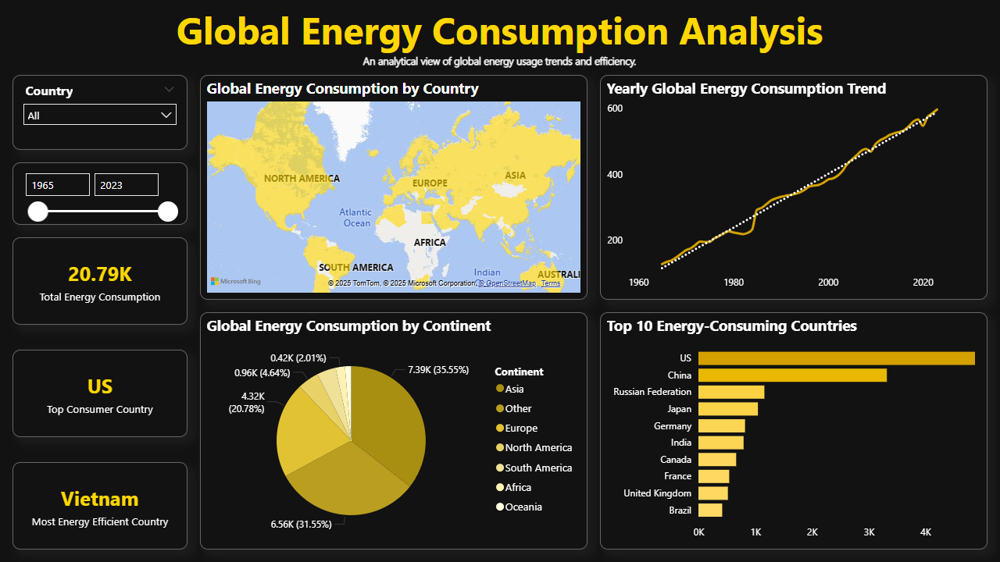

# Global Energy Consumption Dashboard

## Overview
This project presents a comprehensive **Power BI Dashboard** for analyzing global energy consumption trends. The dashboard enables stakeholders to explore energy usage data across different countries, continents, and time periods to identify key insights, trends, and potential areas for improvement.

---

## Objectives
1. **Analyze Global Energy Consumption Trends:** Understand how energy consumption has evolved over the years.
2. **Identify Key Energy Consumers:** Highlight countries with the highest and lowest energy usage.
3. **Assess Energy Efficiency:** Determine the most energy-efficient countries based on consumption per capita.
4. **Enable Interactive Data Exploration:** Provide a visually intuitive dashboard for dynamic data filtering and analysis.
5. **Support Data-Driven Decision Making:** Offer actionable insights for policymakers, researchers, and industry leaders.

---

## Power BI Dashboard

---

## Features
- **Interactive Filled Map:** Displays energy consumption by country with dynamic filtering.
- **Pie Chart by Continent:** Provides a breakdown of energy consumption by continent.
- **Top 10 Energy-Consuming Countries:** Highlights the highest energy consumers using a clustered bar chart.
- **Yearly Global Energy Consumption Trend:** Showcases energy consumption trends over time.
- **Key KPI Cards:** Display total energy consumption, top energy-consuming country, and most energy-efficient country.
- **Slicers for Country & Year:** Enable users to filter data dynamically for in-depth analysis.
- **Dark Theme Design:** Uses a professional midnight black and yellow theme for an optimal viewing experience.

---

## Key Findings
1. **The U.S. and China dominate global energy consumption,** significantly surpassing other countries.
2. **Energy consumption has been steadily increasing,** with key growth periods observed in industrialized nations.
3. **Some countries maintain high efficiency,** balancing economic output with lower energy consumption.
4. **Regions like Asia and North America account for the majority of energy use.**
5. **Sustainable energy practices are crucial,** as global consumption trends indicate rising demand.

---

## Conclusion
The analysis reveals **substantial disparities in energy consumption** among countries and continents. **Developed nations** and **industrial powerhouses** consume the highest energy, while **smaller or developing nations** exhibit greater efficiency per capita. The findings emphasize the need for **renewable energy adoption, energy efficiency improvements, and policy interventions** to ensure sustainable energy consumption globally.

---

## Recommendations
1. **Encourage Renewable Energy Investments** – Governments should promote solar, wind, and hydro energy adoption.
2. **Improve Energy Efficiency Standards** – Implement policies that reduce waste in industrial and residential energy use.
3. **Promote Energy-Efficient Technologies** – Encourage businesses to adopt smart grids and energy-efficient solutions.
4. **Monitor Energy Usage in Real-Time** – Use **data analytics** to track and optimize energy consumption patterns.
5. **Expand Energy Accessibility for Developing Nations** – Facilitate equitable energy distribution worldwide.

---

## Contributors
**Jan Aeron Abrahan**  
[LinkedIn](https://www.linkedin.com/in/aeronabrahan)

---

## Live GitHub Pages Site
🔗 [View the Full Project Documentation](https://aeronabrahan.github.io/Global-Energy-Dashboard/)

---

## Next Steps
1. **Commit this README.md** to your repository.
2. **Deploy GitHub Pages** (Settings → Pages → Deploy from `main`).
3. **Share the link on LinkedIn, portfolio, or resume.**
4. **Enhance the Dashboard** with additional metrics like CO2 emissions per capita.
5. **Integrate Machine Learning** models for energy consumption forecasting.

---

## Acknowledgements
This project was developed using **Power BI**, **GitHub Pages**, and **global energy consumption datasets**. Special thanks to open-source communities for providing resources and datasets for energy analysis.
